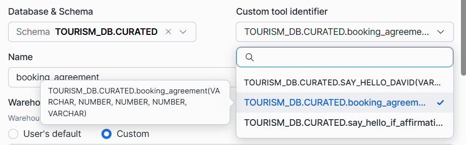
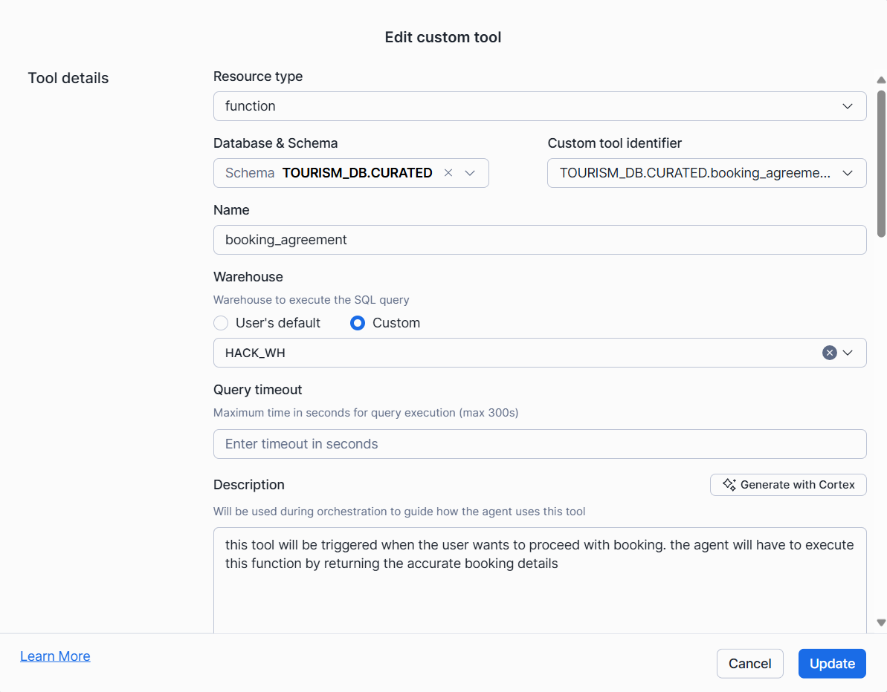
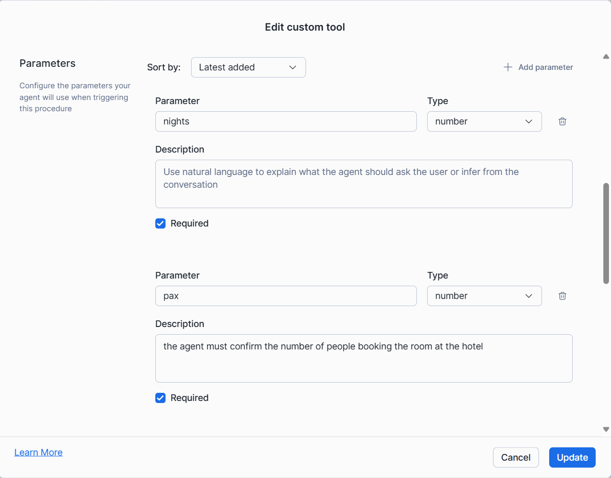
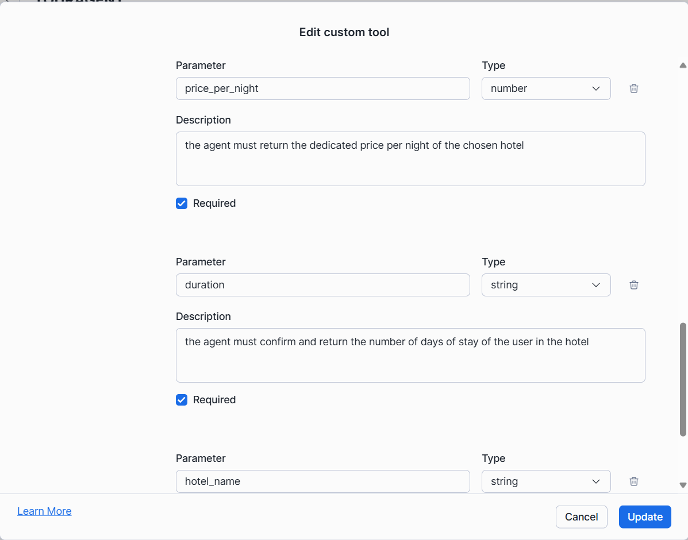
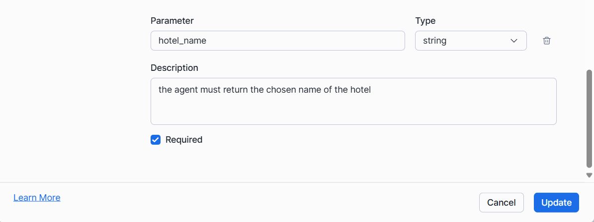
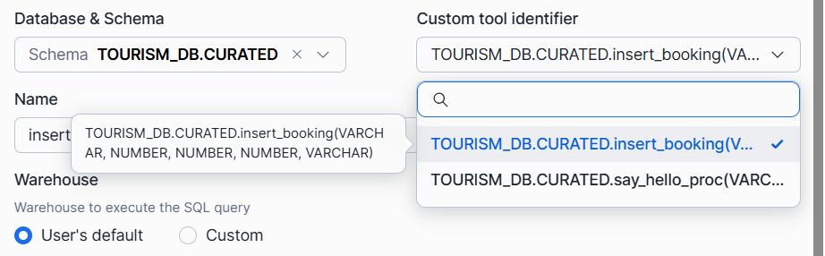
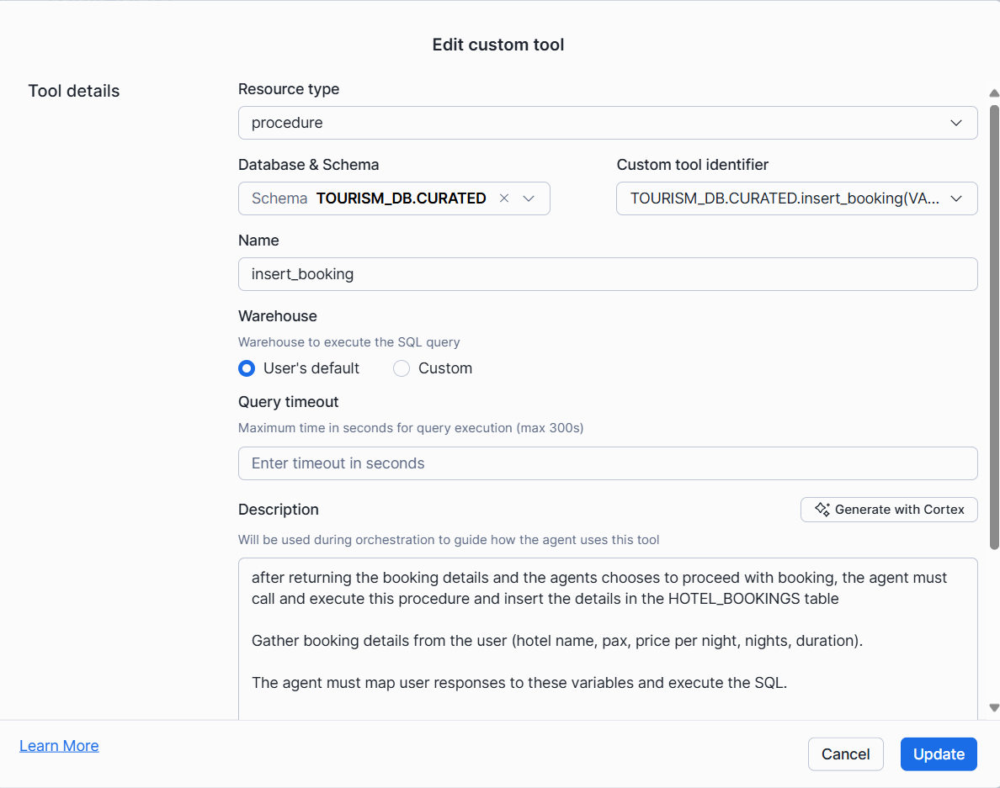
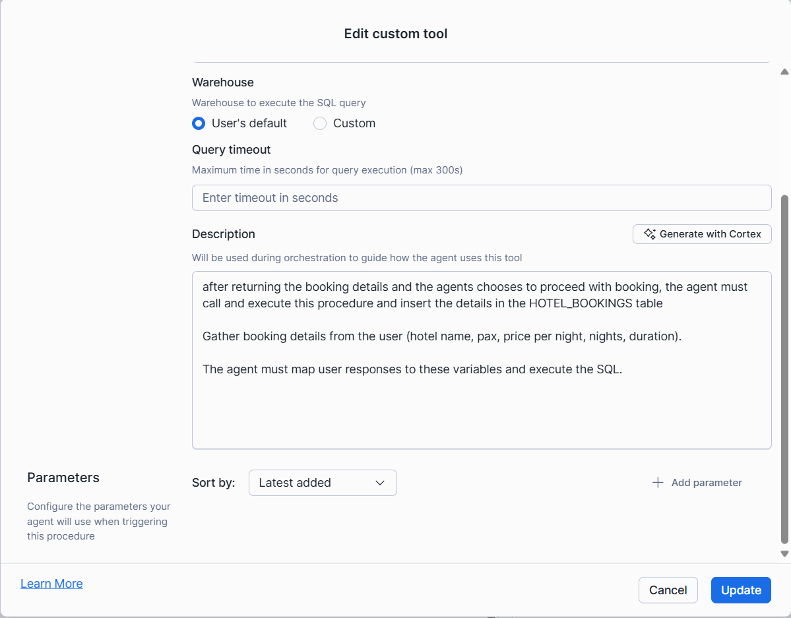

# smart-trip-safety-concierge-agent-sf-hackathon

# 🧭 Smart Trip & Safety Concierge Agent - Snowflake Inteligence

This repository contains the **Snowflake SQL setup and data pipeline** used for the *Smart Trip & Safety Concierge Hackathon* project.  
It builds a full end-to-end environment in Snowflake for managing and analyzing **tourism-related datasets** — including weather, crime, traffic, holidays, points of interest, and hotels.

---

# 🚀 STEP-BY-STEP INSTRUCTIONS

---

## 1) Run the `HACKATHON.ipynb` file in Snowflake to setup the data environment.

This Snowflake notebook `HACKATHON.ipynb` automates the full setup of a data pipeline for the **Smart Trip & Safety Concierge** project.  
It prepares a secure, organized environment for analyzing tourism-related datasets such as weather, traffic, crime, holidays, POIs, and hotels.

### 🔹 IMPORTANT: Detailed Instructions
1. In the `Hackathon.ipynb` notebook, run the first 4 blocks of code: `SCHEMA`, `ROLE`, `STG`, and `RAW_TBLS`.
2. Download the .csv and .txt files found in [CSV_TXT_FILES/](CSV_TXT_FILES/) to your local computer.
3. Upload the following files to their corresponding Stages under `TOURISM_DB.RAW`.
     - `crime_incidents.csv`        -->  `STAGE_CRIME`
     - `hotels.csv`                 -->  `STAGE_HOTELS`
     - `ph_holidays_2025_2026.csv`  -->  `STAGE_HOLIDAYS`
     - `poi_opentripmap.csv`        -->  `STAGE_POI`
     - `traffic_incidents.csv`      -->  `STAGE_TRAFFIC`
     - `traffic_speeds.csv`         -->  `STAGE_TRAFFIC`
     - `weather_hourly.csv`         -->  `STAGE_WEATHER`
     - `gtfs_stop_times_expanded.txt`   -->  `STAGE_GTFS`
     - `gtfs_stops_expanded.txt`        -->  `STAGE_GTFS`
     - `gtfs_trips_expanded.txt`        -->  `STAGE_GTFS`
5. Run the rest of the code in the `Hackathon.ipynb` notebook.

### 🔹 This part does not need execution. It just summarizes what the `HACKATHON.ipynb` code executed.
1. **Set context** — Uses the correct role, warehouse, and database (`ACCOUNTADMIN`, `HACK_WH`, `TOURISM_DB`).  
2. **Create schemas** — Builds `RAW` (raw data) and `CURATED` (processed data) layers.  
3. **Create role** — Defines `CORTEX_APP_ROLE` for controlled analyst access.  
4. **Grant permissions** — Gives the role access to the warehouse, schemas, and tables.  
5. **Define file format** — Sets up a standard CSV format for consistent file loading.  
6. **Create stages** — Makes internal stages for file uploads (weather, crime, holidays, etc.).  
7. **Upload data** — You upload CSV files into the appropriate stages.  
8. **Load raw tables** — Creates tables in `RAW` and loads data from the staged files.  
9. **Transform data** — Cleans and aggregates raw data into curated analytical tables.  
10. **Validate access** — Switches to `CORTEX_APP_ROLE` and confirms proper permissions.  

✅ **Result:**  
A ready-to-use Snowflake data environment for analytics and visualization — secure, structured, and role-based. **There are 8 created Views which will be used as Logical Tables for the Semantic Views in Cortex Analyst.**

---

## 2) In Cortex Analyst, upload the YAML files found in [SEMANTIC_VIEWS/](SEMANTIC_VIEWS/) to create the Semantic Views.

### 🔹 Detailed Instructions
1. Download the YAML files in [SEMANTIC_VIEWS/](SEMANTIC_VIEWS/) to your local computer.
2. In the Snowflake UI, go to AI & ML --> Cortex Analyst.
3. Select the Warehouse `HACK_WH`.
4. Upload the YAML files to create the Semantic Views.
5. Set the Database & Schema to `TOURISM_DB.CURATED` and the Stage to `SEMANTIC_UPLOAD_STAGE`.
6. Ensure that the following 8 Semantic Views are successfully created.
     - `WEATHER_SUITABILITY_SEM`
     - `SAFETY_INDEX_SEM`
     - `HOTEL_RECO_SEM`
     - `POI_SEM`
     - `HOLIDAYS_SEM`
     - `TRAFFIC_LATEST_SEM`
     - `TRAFFIC_ALERTS_SEM`
     - `TRANSIT_NEXT_DEPARTURES_SEM`
7. Note: The created Views from Step 1 were used as Logical Tables for the Semantic Views. Each View directly corresponds to a Semantic View (e.g., `WEATHER_SUITABILITY` --> `WEATHER_SUITABILITY_SEM`).

---

## 3) Run the `PARSE_DOCUMENTS.sql` file in Snowflake to parse the documents.

### 🔹 Detailed Instructions
1. Run the first 3 lines of code of `PARSE_DOCUMENTS.sql` to create the `DOCUMENT_UPLOAD_STAGE`.
2. Download the .zip file containing the .pdf documents from the following Google Drive link. It must contain 21 files.
     - https://drive.google.com/file/d/19Q6E85FlF-Pt1kXsgGs9E0ZzKEqF93JS/view?usp=sharing
3. Upload the .pdf documents to the `DOCUMENT_UPLOAD_STAGE`.
4. Parse the documents by running the rest of the code. After parsing, the `filename` and `content` of the .pdf documents are now stored at the `TOURISM_DOCSEARCH` table under the `TOURISM_DB.CREATED`.

---

## 4) Create the Cortex Search Service (`SEARCH_PDF`).

### 🔹 Detailed Instructions
1. In the Snowflake UI, go to AI & ML --> Cortex Search.
2. Create new Cortex Search Service. Set the Database and Schema to `TOURISM_DB.CREATED`. Set the service name to `SEARCH_PDF`.
3. Select `TOURISM_DOCSEARCH` as the base table.
4. Set the Search column to the `PAGE_CONTENT` column.
5. Set the Attribute column to the `FILENAME` column.
6. Select `HACK_WH` as the Warehouse. Set the target lag to 1 hour.
7. Set the embedding model to `snowflake-arctic-embed-m-v1.5`.
8. After which, the Cortex Search Service must now have been created.

---

## 5) Create the Cortex Agent (`TOURAGENT`).

### 🔹 Detailed Instructions
1. Create a new Cortex Agent. Set the name and display name to `TOURAGENT`.

2. Copy the following instructions to the Response Instructions.
     - Always use a warm, welcoming, and friendly tone in responses.
     - Be suggestive (example: if you want to do these kind of activities... then here are... , if you are into..., then this..) 
     - Be clear, concise, and courteous; avoid long paragraphs or complex sentences.
     - Respond as a helpful travel assistant, using positive and encouraging language.
     - Prioritize user comfort and confidence; reassure users when recommending activities or locations.
     - Use simple, everyday vocabulary that’s easy for all travelers to understand.
     - Never use technical or system terms; avoid references to backend processes or data sources.
     - When asking for clarification, do so politely and show appreciation for the user’s input.
     - Express enthusiasm for local attractions, experiences, and travel opportunities.
     - Avoid making absolute statements about safety or suitability; instead, offer practical guidance and alternatives.
     - Always thank users for their questions and offer further assistance at the end of each response.
     - If a recommendation involves risk (weather, safety, etc.), remind users to check with local authorities for the latest updates.
     - When sharing information, be empathetic to travelers’ needs, including accessibility, family, or special interests.

3. For the Cortex Analyst tools, add all the 8 Semantic Views with their corresponding `Description`.
     - `WEATHER_SUITABILITY_SEM`

WEATHER_SUITABILITY:
- Database: TOURISM_DB, Schema: CURATED
- Contains forecasted weather information and suitability assessments for outdoor and indoor activities in Philippine cities, including temperature, precipitation probability, wind speed, and tailored recommendations.
- Useful for travel planning, activity selection, and providing safety and comfort guidance to tourists and residents based on current and upcoming weather conditions.
- LIST OF COLUMNS: LAT (latitude), LON (longitude), FORECAST_TS (forecast timestamp), TEMP_C (temperature in Celsius), PRECIP_PROB (precipitation probability), WIND_KPH (wind speed in kph), CITY (city name), SUITABILITY (suitability score), RECO (activity recommendation)

REASONING:
This semantic view is designed to help users evaluate weather conditions for specific locations and times, supporting informed decisions about outdoor and indoor activities. By providing suitability scores and actionable recommendations, it enables travelers and locals to plan comfortably and safely. The inclusion of granular forecast data and city-level aggregation ensures relevant, up-to-date advice tailored to user needs.

DESCRIPTION:
The WEATHER_SUITABILITY_SEM semantic view, located in TOURISM_DB.CURATED, serves as a centralized source for weather suitability and activity guidance in the Philippines. Each record details the forecasted temperature, precipitation, wind, and provides a suitability score with a corresponding recommendation for indoor or outdoor activities. This view is especially valuable for queries related to weather-based planning, ensuring travelers and residents can optimize their schedules for safety, enjoyment, and comfort.

     - `SAFETY_INDEX_SEM`

SAFETY_INDEX:
- Database: TOURISM_DB, Schema: CURATED
- Contains incident data for major Philippine cities and barangays, including the date of occurrence and the number of incidents reported per day.
- Useful for assessing local safety conditions, travel risk management, and providing safety guidance to tourists and residents.
- LIST OF COLUMNS: CITY (city name), BARANGAY (local district), D (date of incident), INCIDENTS_DAY (number of incidents reported that day)

REASONING:
This semantic view is designed for monitoring and evaluating safety across different urban areas in the Philippines. It provides timely information on reported incidents, categorized by city and barangay, supporting travel safety assessments and helping travelers make informed decisions about their destinations. The structure facilitates trend analysis and risk evaluation, which is useful for both tourists and local authorities concerned with public safety.

DESCRIPTION:
The SAFETY_INDEX_SEM semantic view, located in TOURISM_DB.CURATED, acts as a centralized source for incident reporting and safety monitoring in Philippine cities and barangays. With daily records of incidents, this view enables users to evaluate the relative safety of different locations, plan safer travel routes, and stay updated on recent safety trends. It is particularly valuable for queries relating to local risk assessment, travel advisories, and situational awareness for visitors and residents.
  
     - `HOTEL_RECO_SEM`

HOTEL_RECO:
- Database: TOURISM_DB, Schema: CURATED
- Contains detailed records of hotel accommodations in key Philippine cities, including hotel names, locations, star ratings, nightly prices in Philippine Peso, refund policies, guest ratings, amenities, safety scores, geographic coordinates, and an overall computed score.
- Useful for travel planning, accommodation selection, safety assessment, and personalized recommendations for tourists and business travelers.
- LIST OF COLUMNS: HOTEL_ID (unique hotel identifier), NAME (hotel name), CITY (city location), AREA (specific area or neighborhood), STARS (star rating), PRICE_NIGHT_PHP (nightly price in ₱), REFUNDABLE (refund policy), RATING (guest review score), AMENITIES (list of amenities), SAFETY_SCORE (safety assessment score), LAT (latitude), LON (longitude), SCORE (overall hotel score)

REASONING:
This semantic view is designed for comprehensive hotel information management and recommendation, supporting the Philippine tourism sector. It enables users to compare accommodations based on price, safety, amenities, and guest ratings, empowering informed decision-making for travel stays. The inclusion of safety scores and location coordinates further enhances safe and convenient travel planning, while the amenity list matches hotel offerings to traveler preferences and needs.

DESCRIPTION:
The HOTEL_RECO_SEM semantic view, located in TOURISM_DB.CURATED, serves as a centralized resource for hotel information relevant to both tourists and business travelers in the Philippines. Each record features key details such as location, nightly price, star rating, refund policy, guest ratings, amenities, and safety scores. This view allows users to efficiently filter and compare hotels according to their requirements and safety considerations. The geographic coordinates and computed scores support integration with mapping and recommendation systems, making HOTEL_RECO_SEM especially valuable for queries about accommodation options, pricing, safety, proximity to attractions, and personalized travel planning.

     - `POI_SEM`

POINT_OF_INTEREST:
- Database: TOURISM_DB, Schema: CURATED
- Contains curated information about major points of interest in the Philippines, including names, types (kinds), geographic coordinates, visitor ratings, and popularity scores.
- Useful for travel planning, attraction recommendation, and itinerary building for leisure and cultural tourism.
- LIST OF COLUMNS: POI_ID (unique identifier), NAME (point of interest name), KINDS (type/category such as museum or cultural site), LAT (latitude), LON (longitude), RATE (visitor rating), POPULARITY_SCORE (popularity index)

REASONING:
This semantic view is designed to help users easily discover and evaluate noteworthy attractions and cultural sites in the Philippines. It provides concise details for each point of interest, including type, location, and visitor ratings, supporting personalized travel recommendations and itinerary planning. The inclusion of popularity scores and geographic data enables effective filtering and mapping, enhancing the overall travel experience for both tourists and locals.

DESCRIPTION:
The POINT_OF_INTEREST_SEM semantic view, located in TOURISM_DB.CURATED, serves as a centralized catalog of key attractions and cultural sites throughout the Philippines. Each entry includes a unique identifier, name, type, rating, popularity score, and coordinates, making it easy to search for and compare various destinations. This view is especially valuable for queries related to top-rated museums, cultural venues, and tourist hotspots, facilitating efficient attraction discovery and itinerary customization for travelers seeking memorable experiences.

     - `HOLIDAYS_SEM`

HOLIDAYS:
- Database: TOURISM_DB, Schema: CURATED
- Contains information about public holidays in the Philippines, including both local and English names of the holidays and their corresponding dates.
- Useful for business planning, scheduling, and time-off management in the Philippine context.
- LIST OF COLUMNS: LOCAL_NAME (holiday name in local language), NAME (holiday name in English), DATE (date of the holiday)

REASONING:
This semantic view focuses on Philippine holiday information management, providing a comprehensive view of public holidays with their dates and names in both local and English versions. The structure allows for easy holiday tracking and scheduling, which is essential for businesses operating in the Philippines. The view is particularly useful for organizations that need to manage schedules, plan operations, and handle time-off requests around Philippine holidays.

DESCRIPTION:
The HOLIDAY_SEM semantic view, located in TOURISM_DB.CURATED, serves as a centralized repository for Philippine public holiday information. It maintains a comprehensive list of holidays with their corresponding dates and provides both local and English names for each holiday, making it valuable for both domestic and international users. The view supports various business operations including workforce planning, scheduling, and holiday-related activities management. This semantic view is particularly useful for queries related to holiday dates, names, and cultural significance in the Philippine context, enabling efficient holiday-based planning and operations management.

     - `TRAFFIC_LATEST_SEM`

TRAFFIC_LATEST:
- Database: TOURISM_DB, Schema: CURATED
- Contains the most recent traffic status and speed data for major road segments in the Philippines, including route names, geographic coordinates, timestamps, vehicle speeds, and congestion levels.
- Useful for real-time travel planning, route optimization, and providing up-to-date road condition information to drivers and travelers.
- LIST OF COLUMNS: SEGMENT_ID (unique road segment identifier), ROAD_NAME (road or route name), START_LAT (starting latitude), START_LON (starting longitude), END_LAT (ending latitude), END_LON (ending longitude), AS_OF_TS (timestamp of latest update), SPEED_KPH (average speed in kph), CONGESTION_LEVEL (traffic congestion status)

REASONING:
This semantic view enables quick assessments of current traffic flows and congestion across key urban corridors in the Philippines. By including speed data, route details, and congestion levels, it supports informed travel decisions and effective route planning. Timestamped updates allow users to monitor trends and respond to changing road conditions.

DESCRIPTION:
The TRAFFIC_LATEST_SEM semantic view, located in TOURISM_DB.CURATED, functions as a centralized source for real-time traffic information on major Philippine roads. Each entry provides details about the route, start/end coordinates, the latest speed and congestion level, and the time of the update. This view is especially valuable for queries related to current travel times, congestion hotspots, and optimal routing, helping users navigate efficiently and avoid delays.

     - `TRAFFIC_ALERTS_SEM`

TRAFFIC_ALERTS:
- Database: TOURISM_DB, Schema: CURATED
- Contains real-time and historical traffic alerts for major Philippine road segments, including alert type, severity, date and time, and precise location coordinates.
- Useful for travel safety, route planning, and providing timely notifications about road conditions to drivers and travelers.
- LIST OF COLUMNS: SEGMENT_ID (unique road segment identifier), ROAD_NAME (road or route name), AS_OF_TS (alert timestamp), TYPE (type of traffic event, e.g., roadwork, breakdown, flooded lane), SEVERITY (level of impact), LAT (latitude), LON (longitude)

REASONING:
This semantic view is designed to inform users about current and recent traffic disruptions across key roadways in the Philippines. By including event types, severity levels, and specific locations, it supports proactive travel planning and helps users avoid delays or hazards. The timestamped records allow for trend analysis and improve travel advisories by showing both active and historical alerts.

DESCRIPTION:
The TRAFFIC_ALERTS_SEM semantic view, located in TOURISM_DB.CURATED, serves as a centralized source for traffic event notifications on Philippine roads. Each alert provides essential details such as the affected route, nature of the incident, severity, and exact position. This view is especially valuable for queries related to road closures, construction, breakdowns, and other disruptions, enabling users to make informed decisions about travel routes and times, and supporting safe and efficient journey planning.

     - `TRANSIT_NEXT_DEPARTURES_SEM`

TRANSIT_NEXT_DEPARTURE:
- Database: TOURISM_DB, Schema: CURATED
- Contains upcoming public transportation departures for key Philippine transit routes, including trip and stop identifiers, scheduled arrival times, stop names and locations, route information, and destination heads.
- Useful for transit planning, itinerary scheduling, and providing real-time travel options to tourists and commuters.
- LIST OF COLUMNS: TRIP_ID (unique trip identifier), STOP_ID (unique stop identifier), ARRIVAL_TIME (scheduled arrival time), ARR_T (actual arrival time), STOP_NAME (name of the transit stop), STOP_LAT (latitude), STOP_LON (longitude), ROUTE_ID (route identifier), TRIP_HEADSIGN (route/direction headsign)

REASONING:
This semantic view is designed to help users easily access upcoming departures for buses, trains, and other transit modes in the Philippines. It provides essential scheduling and location data for each trip and stop, supporting efficient itinerary planning and real-time travel choices for both tourists and daily commuters. The inclusion of route and headsign information enables clear navigation and route selection.

DESCRIPTION:
The TRANSIT_NEXT_DEPARTURE_SEM semantic view, located in TOURISM_DB.CURATED, serves as a centralized source for public transportation departure information. Each record details the trip and stop identifiers, arrival times, stop locations, routes, and destination heads, allowing users to quickly find and plan their next transit move. This view is especially valuable for queries related to upcoming departures, transit schedules, and optimal route selections, helping travelers manage their time and navigate the transit system with ease.

4. For the Cortex Search Services, add the `SEARCH_PDF` with the following `Description`. Set the `PAGE_CONTENT` as the ID column and the `FILENAME' as the Title column.
     - This tool contains and will provide the information of different activities and accommodations of all the cities in Metro Manila

5. Add 'BOOKING_AGREEMENT' custom tool with the following settings. 
     
     
     
     
     

6. Add 'INSERT_BOOKING' custom tool with the following settings.
     
     
     

7. For the Orchestration, copy the following text as the Planning Instructions.

GENERAL INSTRUCTIONS:
- Focus responses strictly on the available datasets provided; do not reference information outside of the datasets.
- If the location is not in the dataset, don't force it
- Consider all the factors such as holiday, hotel, places, and activities recommendations, weather suitability, traffic reports, and safety index in the place first in every question.
- Use data from cortex search first (provide the source), followed by data from cortex analyst 
- Always check first if the answer is searchable within our dataset. if not, don't continue looking for imaginary answers.
- Be suggestive (example: if you want to do... then this, if you are into..., then this..)
- Carefully read and interpret each question before answering; only respond to questions that originate directly from the user and only respond to one question at a time. 
- Understand the question of the user, focus on the specific file name from cortex analyst based on the place they mentioned
- If no relevant data is present, do not provide any answer or suggestion and do not use local or general knowledge in your response.
- Begin each response with a concise summary of the main finding or recommendation, then present key suggestions in clear bullet points immediately following the summary.
- End each response with a practical recommendation for the user.
- Format all monetary values using ₱ (Philippine Peso), rounded to 2 decimal places.
- Do not state safety index, precipitation probability, or hotel safety score as raw values. however, when providing a these, explain why

HOLIDAY INQUIRIES:
- Reference the `HOLIDAYS_SEM` semantic view for holiday-related responses only.
- Always include both the local holiday name and its corresponding date.

HOTEL RECOMMENDATIONS:
- Derive all hotel suggestions exclusively from the `HOTEL_RECO` semantic view.
- Always mention: hotel name, area, star rating, price per night, and notable amenities.

POINTS OF INTEREST:
- Use the `POI_SEM` semantic view for information and recommendations about points of interest.

SAFETY INDEX:
- If the total daily incidents in an area exceed 5, proactively suggest alternative locations for safety.

TRAFFIC ALERTS:
- Clearly highlight the route, current traffic status, and next available times.
- Communicate the type of alert, its severity, specific location, and any history of similar alerts.

WEATHER SUITABILITY:
- Always check the weather dataset to see weather forecast
- If precipitation probability exceeds 60%, recommend indoor places or activities.

8. Add the following questions as Example Questions.
     - Create a 3-day travel itinerary for Makati, including hotel recommendations, points of interest, and dining options.
     - What are the top 5 hotels in BGC with high safety scores and family-friendly amenities?
     - Are there any holidays in Manila this month that might affect sightseeing or business hours?
     - Suggest indoor activities in Manila for a rainy day, including museums and cafes.

---

## 6) Open the Snowflake Intelligence. Select the Agent as `TOURAGENT`. You may start with the suggested prompts or example questions provided in Step 5.8.

---
